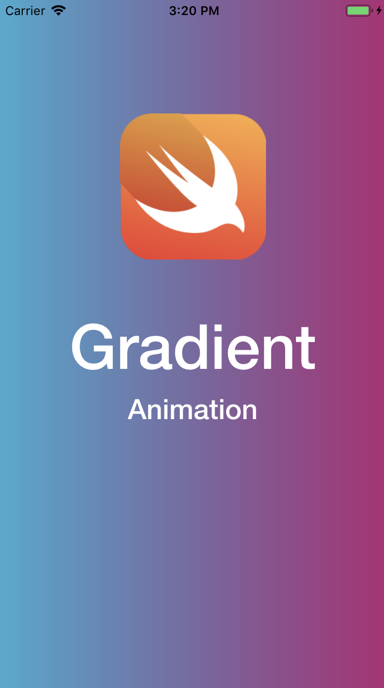

## Left to Right

```
        gradient.startPoint = CGPoint(x:1, y:1)
        gradient.endPoint = CGPoint(x:0, y:1)
```


## Bottom to Top

```
        gradient.startPoint = CGPoint(x:1, y:0)
        gradient.endPoint = CGPoint(x:1, y:1)
```


## Diagonally

```
        gradient.startPoint = CGPoint(x:1, y:1)
        gradient.endPoint = CGPoint(x:0, y:0)
```
